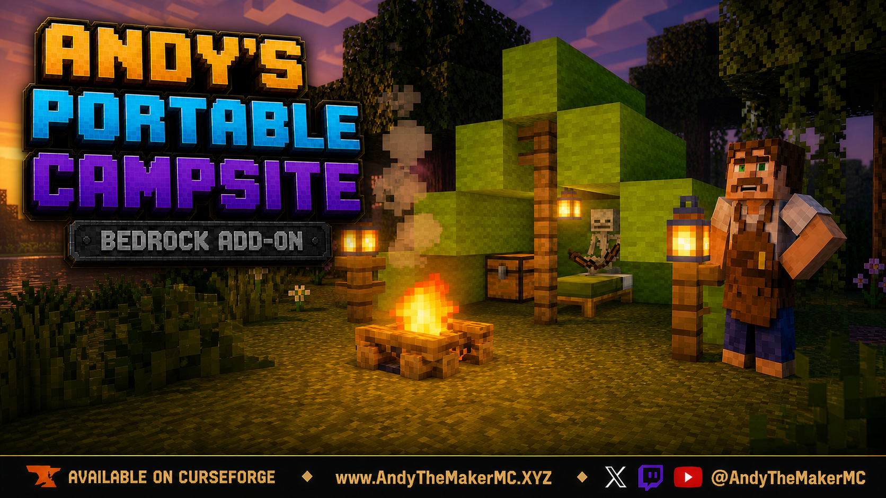
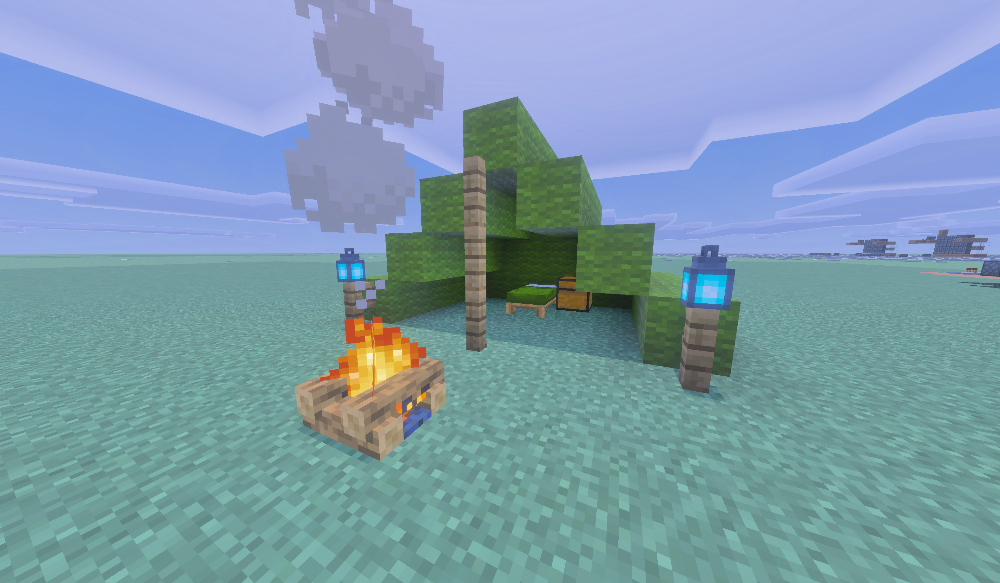
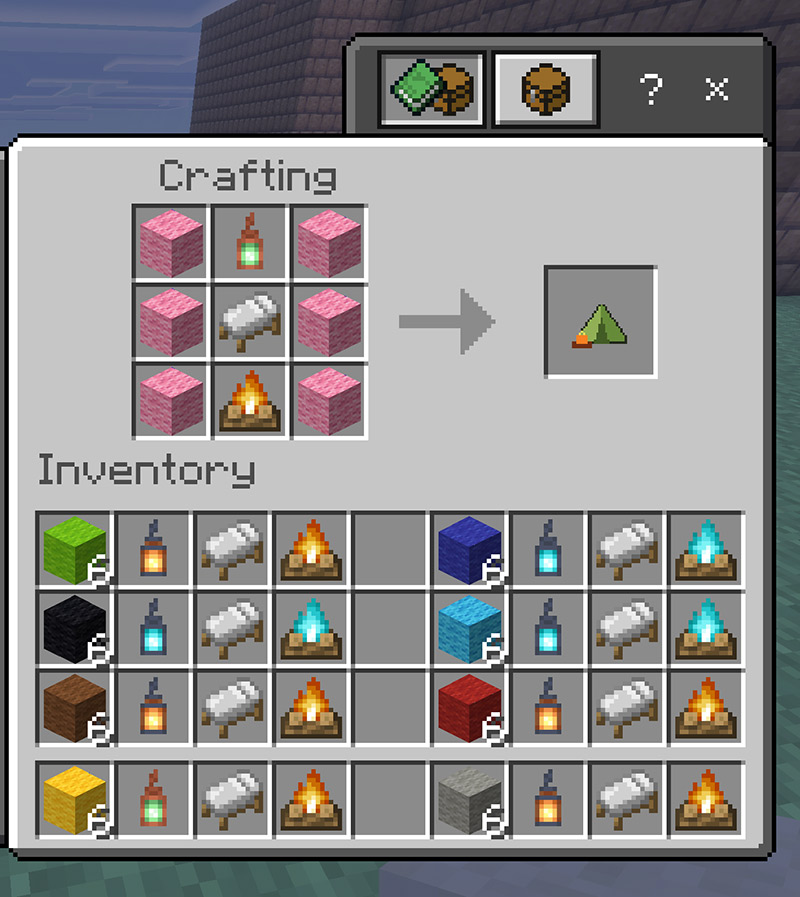
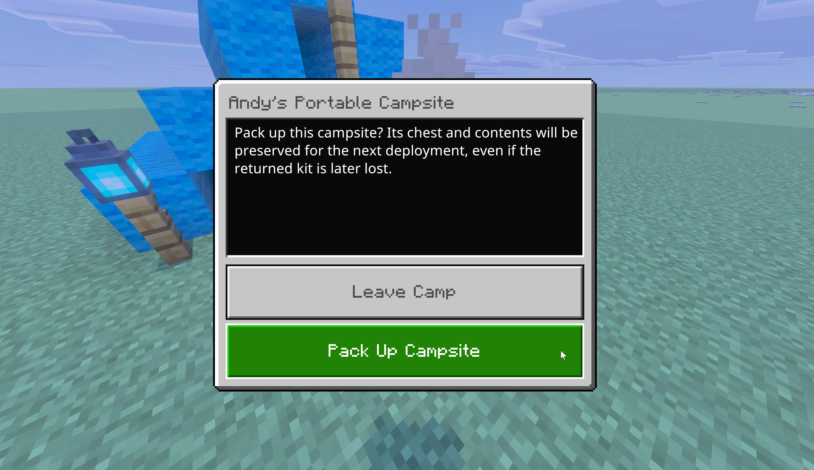

  

# Andy's Portable Campsite

**Turn one compact, reusable kit into a complete expedition camp—and pack it all away again when morning comes.**

Andy's Portable Campsite is a standalone Minecraft Bedrock add-on. Craft a Reusable Campsite Kit, place it, and deploy a tall five-block-long stepped wool tent with a functional vanilla bed, a persistent owner-linked chest, three lanterns, and a campfire. When you are ready to move, interact with the campfire and pack the entire camp back into the kit.

This is the campsite from Andy's Explorers Backpack as its own focused add-on. The backpack edition remains available and unchanged. The two editions are separate choices and should not be used together to duplicate an active camp.

The camp is built from native Minecraft blocks and lighting, so it fits survival worlds and works with Vibrant Visuals.

**Current release:** 1.5.0  
**Download:** [Andys_Portable_Campsite_1.5.0.mcaddon](Andys_Portable_Campsite_1.5.0.mcaddon)  
**SHA-256:** `9446E9346D76C62259BFF564DAC1174FA3502F93412BFCD615736AD65D0A4D4B`

Minecraft Bedrock **26.40 or newer** is required. Cheats, commands, and experimental gameplay toggles are not required.

See the [project wiki](https://github.com/CharlesJGantt/Andys-Portable-Campsite/wiki) for the complete player guide.

## 1.5.0

- The kit recipe now accepts **every vanilla lantern**: Lantern, Soul Lantern, and all four copper oxidation stages - Copper, Exposed, Weathered, and Oxidized - plus the waxed form of each. Previously only Lantern, Soul Lantern, and pristine unwaxed Copper Lantern worked, and wax or oxidation had to be scraped off with an axe first.
- The camp is pitched with the exact lantern that was paid.
- Copper weathering is remembered across pack-up. A camp's three lanterns age independently while it stands, and packing up records the stage each one reached, so redeploying keeps the patina instead of resetting to fresh copper. Waxed lanterns do not weather.
- Fixed camps built with a Copper Lantern becoming permanently impossible to pack up. Unwaxed copper weathers on its own, so a camp lantern could turn exposed, weathered, or oxidized hours after the camp was pitched; pack-up compared it against the block it had originally placed, saw a different block, and refused. Camps already stuck this way pack up normally after updating. Camps using a plain Lantern or Soul Lantern were never affected.
- A genuinely obstructed camp now reports the exact coordinates of the blocking cell, what was expected there, and what was found instead.
- Nothing needs reconfiguring. Existing kits, deployed camps, chest archives, ownership, colors, and hearth choices are unchanged.

## 1.4.2

- Fixed a code regression that made the campsite chest give back its contents twice. The chest was archived and restored correctly on the next deployment, but packing up also dropped a second copy of everything on the ground.
- Packing up a stocked camp now leaves nothing on the ground, and every item is waiting in the chest when the camp is deployed again.
- Pack-up is refused instead of proceeding when the chest cannot be emptied safely, including when a player-placed chest has been set against the campsite chest to form a large chest.
- Comforting Campfires hearth recipes moved into a third pack in the same download, **Andy's Portable Campsite - Comforting Campfires Bridge**. Activate it only if Andy's Comforting Campfires is installed; Minecraft will not activate it otherwise.
- Worlds without Andy's Comforting Campfires no longer log hearth recipe errors when they load.
- Nothing needs reconfiguring. Existing kits, deployed camps, chest archives, ownership, colors, and the vanilla Campfire and Soul Campfire recipes are unchanged.

## 1.4.0

- Added optional compatibility with Andy's Comforting Campfires. A Comforting Campfire, Comforting Soul Campfire, Hearthfire Campfire, or Hearthfire Soul Campfire can be crafted into the kit, and the deployed hearth keeps its Comfort healing, runes, and crouch-interact status menu across pack-up and redeployment.
- Beds spawn in the same color as the wool used to craft the kit.

## 1.3.2

- Moved all three stacked center fence supports one block back onto the first floor block inside the tent opening, so they form the intended tent pole.
- Colored beds now place from saved head/foot structures so the tent bed matches the kit and sits correctly when the camp deploys.

  

## Features

- One reusable Campsite Kit instead of a pile of loose building blocks
- Tall stepped five-block-long wool tent with an open front
- Functional native Minecraft bed for sleeping and spawn-setting
- Persistent owner-linked chest restored on the next deployment
- Two lantern posts at the entrance and one hanging lantern inside
- Campfire two blocks in front of the tent, used to pack up
- Sixteen tent-canvas colors from matching wool
- Sixteen bed colors
- Regular, soul, and copper lantern lighting, at every copper oxidation stage
- Regular and soul campfires
- Owner-only pack-up and protected temporary camp blocks
- Replacement kits reconnect to the same player-owned chest archive
- Safe drop at your feet if inventory is full after pack-up
- Vibrant Visuals compatible
- Optional Comforting Campfires hearth kits through the included bridge pack
- Standalone; Andy's Explorers Backpack is not required, and already contains this campsite if you use it

## Crafting

Craft the kit in a **normal Crafting Table** with this exact pattern. All six wool blocks must be the same color.

| Wool | Lantern | Wool |
|---|---|---|
| Wool | Bed | Wool |
| Wool | Campfire | Wool |

  

The kit remembers the materials used:

- The wool color becomes the tent canvas
- The selected bed supplies the camp's functional sleeping area
- Any vanilla lantern sets the lighting: Lantern, Soul Lantern, or any copper stage, waxed or unwaxed
- A regular Campfire or Soul Campfire is placed at the entrance

## Using the Campsite

1. Put the Reusable Campsite Kit in your hotbar.
2. Face the direction the tent should open.
3. Use the kit on the block where the center of the tent floor should begin.
4. Use the bed and chest normally.
5. Interact with the campsite's campfire and choose **Pack Up Campsite**.

Only one campsite may be actively deployed per player. Other players cannot pack up your campsite or access its protected chest.

  

The returned kit goes to your inventory, or safely drops at your feet if the inventory is full. Temporary campsite blocks are protected from harvesting.

## Persistent Chest

Chest contents belong to the player who crafted the kit. They are archived during play and restored on the next deployment. If a packed kit is lost or destroyed, crafting a replacement reconnects that player to the same stored chest contents.

Recrafting does not duplicate an actively deployed campsite.

## Installation

### Windows, Android, iPhone, and iPad

1. Download `Andys_Portable_Campsite_1.5.0.mcaddon` from this repository.
2. Open the file with Minecraft Bedrock.
3. Wait for Minecraft to confirm that the included packs imported successfully.
4. Create a world, or edit the world where you want to use the add-on.
5. Activate **Andy's Portable Campsite** under Behavior Packs. Confirm that **Andy's Portable Campsite Resources** is also active.
6. Optional: activate **Andy's Portable Campsite - Comforting Campfires Bridge** only if Andy's Comforting Campfires is installed. It carries the hearth crafting recipes and nothing else.
7. Enter the world and craft the kit at a normal Crafting Table.

Back up an important world before installing or updating any add-on.

### Xbox, PlayStation, and Nintendo Switch

Consoles generally cannot import arbitrary local `.mcaddon` files directly. Import and activate the add-on on Windows or mobile, upload the prepared world to a Realm, and join that Realm from the console.

## Compatibility

- Minecraft Bedrock 26.40 or newer
- Standard graphics and Vibrant Visuals
- Single-player, multiplayer, Realms, and supported Bedrock servers
- No required dependencies
- Optional companion: Andy's Comforting Campfires, through the included bridge pack
- Andy's Explorers Backpack contains the same campsite; run one edition or the other
- No experimental gameplay toggles
- No commands or Cheats required

## Troubleshooting

**The recipe does not appear:** Confirm both packs imported successfully, the behavior pack is active, and the world is running Bedrock 26.40 or newer. Arrange the ingredients in the exact pattern shown above and use six matching wool blocks.

**The Comfort hearth recipe does not appear:** Confirm Andy's Comforting Campfires is installed and active in the world, and that the Comforting Campfires Bridge pack is active as well. Minecraft will not let the bridge pack activate without Comforting Campfires installed.

**The kit will not deploy:** Pack up your existing active campsite first. Then select the kit in your hotbar and use it on the ground with enough open space for the tent.

**The kit did not enter my inventory after pack-up:** Check the ground at your feet. A full inventory causes the returned kit to drop safely instead.

**The chest is empty after making a replacement:** Make sure the replacement was crafted and deployed by the same Minecraft player identity that owned the original campsite.

**The tent faces the wrong direction:** Face the direction you want the entrance aligned before using the kit.

## Follow and Support Andy

Visit [AndyTheMakerMC.xyz](https://AndyTheMakerMC.xyz) for Andy's add-ons, world lore, tutorials, guides, videos, and other Minecraft content.

Follow **@AndyTheMakerMC** on:

- [YouTube](https://www.youtube.com/@AndyTheMakerMC)
- [Twitch](https://twitch.tv/AndyTheMakerMC)
- [X](https://x.com/AndyTheMakerMC)
- [TikTok](https://www.tiktok.com/@AndyTheMakerMC)
- [Instagram](https://www.instagram.com/AndyTheMakerMC)

Support future projects through [Ko-fi](https://ko-fi.com/andythemaker) or a [direct Stripe contribution](https://buy.stripe.com/4gM4gz0qu0xwgxw0IfcMM00).

## Player, Server, Realm, and Content Creator Permission

Players may use an official, unmodified release of Andy's Portable Campsite in personal worlds, multiplayer worlds, Realms, and servers. Normal delivery of the official, unmodified add-on to players joining an authorized world, Realm, or server is permitted.

Content creators may use, review, and showcase an official, unmodified release in worlds, multiplayer worlds, Realms, servers, videos, livestreams, screenshots, tutorials, reviews, showcases, articles, guides, social posts, and other original gameplay content, including monetized content.

Credit to **AndyTheMakerMC** and a link to the official project page are appreciated whenever practical.

These permissions do not allow anyone to offer the add-on file as a separate download or to modify, translate, adapt, decompile, disassemble, reverse engineer, extract, repackage, mirror, rehost, resell, sublicense, redistribute, or reuse any project content.

## All Rights Reserved License

**All Rights Reserved. Copyright © 2026 Andy / AndyTheMakerMC.**

Except for the limited player, server, Realm, and content-creator permissions above, no part of the add-on, documentation, branding, textures, models, or promotional artwork may be redistributed, reuploaded, rehosted, mirrored, resold, sublicensed, bundled, repackaged, modified and published, translated, adapted, decompiled, disassembled, reverse engineered, extracted, reused, or incorporated into another add-on, pack, application, website, download, or project without prior written permission from the copyright holder.

The promotional artwork is original AI-assisted concept artwork directed for this project. It is not an in-game screenshot.

Minecraft is a trademark of Microsoft Corporation. This project is not affiliated with, endorsed by, sponsored by, or associated with Microsoft or Mojang Studios.
